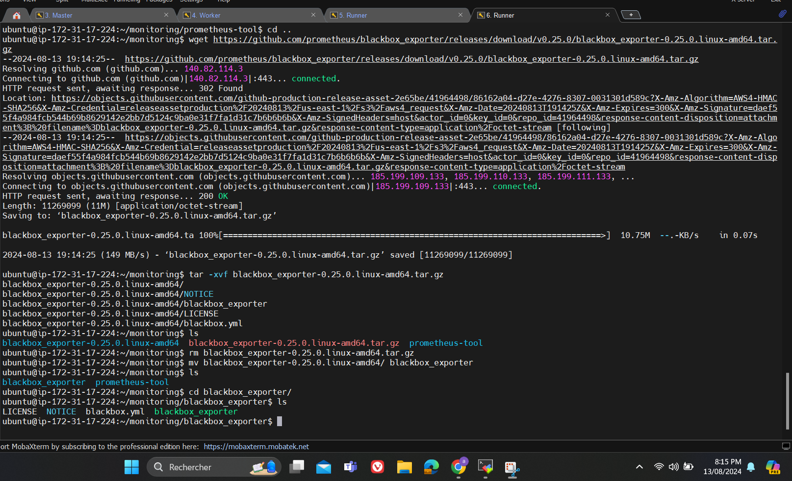
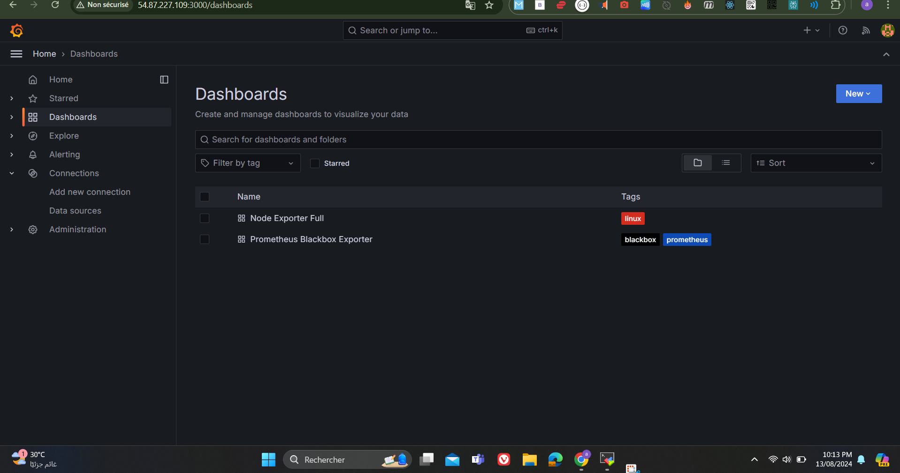

#  CI/CD Pipeline with Kubernetes Deployment and Monitoring

## Table of Contents

1. [Project Overview](#project-overview)
2. [Technologies Used](#technologies-used)
3. [Setting Up the CI/CD Pipeline](#setting-up-the-cicd-pipeline)
   - [GitHub Actions Configuration](#github-actions-configuration)
   - [SonarQube Integration](#sonarqube-integration)
   - [Trivy Security Scanning](#trivy-security-scanning)
4. [Docker Image Management](#docker-image-management)
5. [Kubernetes Setup](#kubernetes-setup)
   - [Namespace and Role Setup](#namespace-and-role-setup)
   - [Deployment and Service Configuration](#deployment-and-service-configuration)
   - [Secrets Management](#secrets-management)
6. [Monitoring with Prometheus and Grafana](#monitoring-with-prometheus-and-grafana)
   - [Prometheus Setup](#prometheus-setup)
   - [Blackbox Exporter Setup](#blackbox-exporter-setup)
   - [Node Exporter Integration](#node-exporter-integration)
7. [Accessing the Application](#accessing-the-application)
8. [Conclusion](#conclusion)

## Project Overview

This project demonstrates the deployment of a BoardGame application using a CI/CD pipeline. The pipeline automates the process of building, testing, and deploying the application using GitHub Actions, Docker, Kubernetes, and monitoring tools like Prometheus and Grafana.

## Technologies Used

- **GitHub Actions**: Automates the CI/CD pipeline.
- **SonarQube**: Static code analysis tool integrated into the pipeline.
- **Trivy**: Security scanner for vulnerabilities in Docker images.
- **Docker**: Containerizes the application.
- **Kubernetes**: Manages the deployment of containers.
- **Prometheus**: Monitors the application and infrastructure.
- **Grafana**: Visualizes the metrics collected by Prometheus.

## Setting Up the CI/CD Pipeline

### GitHub Actions Configuration

The CI/CD pipeline is defined in GitHub Actions, automating tasks such as building, scanning, and deploying the application.

#### Secrets Configuration

- **Repository Secrets**:
  - `SONAR_HOST_URL`: The URL of your SonarQube server.
  - `SONAR_TOKEN`: Authentication token for SonarQube.
  - `KUBE_CONFIG`: Kubernetes configuration for deploying the application.

#### Pipeline Steps

The pipeline includes several stages:

1. **Checkout Code**: Uses the `actions/checkout@v4` action to check out the repository code.
2. **SonarQube Scan**: Analyzes the code quality using SonarQube.
   - 
   - 
3. **Trivy FS Scan**: Scans the filesystem for vulnerabilities using Trivy.
   - 
4. **Build Docker Image**: Builds the Docker image for the application.
   - 
5. **Upload Artifact**: Stores the build artifact for later use.
6. **Push Docker Image**: Pushes the built image to Docker Hub.
   - 
7. **Deploy to Kubernetes**: Deploys the application to a Kubernetes cluster using the provided `KUBE_CONFIG`.

### SonarQube Integration

SonarQube is integrated into the CI pipeline for static code analysis. This ensures that the code meets quality standards before proceeding to build and deployment stages.

- **SonarQube Project Configuration**:
  - The SonarQube project is set up to automatically scan the code and report issues directly in the CI pipeline.
  - 

### Trivy Security Scanning

Trivy is used to scan Docker images for vulnerabilities, ensuring that the deployed containers are secure.

- **Trivy Installation**:
  - Trivy is installed and configured as part of the CI pipeline.
  - 

## Docker Image Management

### Docker Hub Repositories

- **Docker Images**:
  - The Docker images are tagged and pushed to Docker Hub repositories as part of the CI/CD pipeline.
  - Repositories include `kirox2023/boardgame`, `vermegimageprod`, `devopsvermeg`, etc.
  - 

## Kubernetes Setup

### Namespace and Role Setup

Kubernetes is configured to deploy the BoardGame application.

- **Namespace Creation**:
  - A namespace `webapps` is created to isolate the application resources.
  - 

- **RoleBinding**:
  - The role is bound to the service account to allow actions within the namespace.
  - 

### Deployment and Service Configuration

The application is deployed using Kubernetes Deployment and Service resources.

- **Deployment Configuration**:
  - The deployment is defined to manage replicas of the application.
  - 

- **Service Configuration**:
  - A Kubernetes Service is configured to expose the application to external traffic.
  - 

### Secrets Management

Secrets are managed using Kubernetes secrets to securely store sensitive information.

- **Kubernetes Secrets**:
  - A secret is created for accessing the Kubernetes cluster.
  - 

## Monitoring with Prometheus and Grafana

### Prometheus Setup

Prometheus is set up to monitor the Kubernetes cluster and the application.

- **Prometheus Installation**:
  - Prometheus is downloaded and installed on the cluster.
  - 

- **Prometheus Configuration**:
  - Prometheus is configured to scrape metrics from the application and other exporters.
  - 

### Blackbox Exporter Setup

The Blackbox Exporter is set up to monitor the availability and performance of HTTP endpoints.

- **Blackbox Exporter Installation**:
  - The Blackbox Exporter is installed and configured in Prometheus.
  - 

- **Prometheus Targets**:
  - Prometheus is configured to scrape metrics from the Blackbox Exporter.
  - 

### Node Exporter Integration

The Node Exporter is integrated into Prometheus to monitor the system metrics of the Kubernetes nodes.

- **Node Exporter Installation**:
  - Node Exporter is installed to gather metrics such as CPU, memory, and disk usage.
  - 

- **Grafana Dashboards**:
  - Grafana is set up to visualize the metrics collected by Prometheus.
  - Dashboards for the Blackbox Exporter and Node Exporter are imported into Grafana.
  - 
  - 

## Accessing the Application

- **Application URL**: The BoardGame application is accessible at [http://3.80.53.49:32389](http://3.80.53.49:32389).
  - The application lists board games like Splendor, Clue, and Linkee.
  - 

- **Monitoring Dashboards**:
  - **Prometheus Dashboard**: Accessible at `http://54.87.227.109:9090/targets`.
  - **Grafana Dashboard**: Accessible at `http://54.87.227.109:3000`.
  - 
  - 

## Conclusion

This project successfully demonstrates the full lifecycle of a CI/CD pipeline with Kubernetes deployment and comprehensive monitoring using Prometheus and Grafana. The BoardGame application is built, tested, deployed, and monitored, providing an efficient and automated workflow from development to production.
